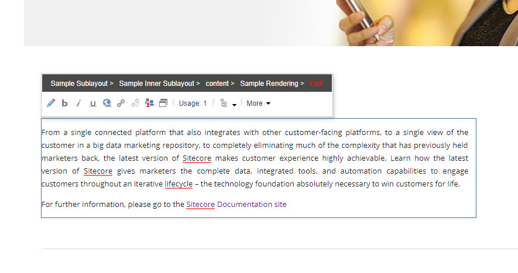

# EEHelper

# Welcome to Sitecore xMen

Steve Bridges

Rob Reilley

Christopher Westfall

## Summary

To help Content Editors understand the relation between components and the page, we created a module which allows them to easily see the component in realtion to the rest of the page.

**Category:** 

Best enhancement to the Sitecore Admin (XP) UI for Content Editors & Marketers

The module makes it easy for Content Authors to see how a component is structured in relation to the page.
    
It helps close the knowledge gap of how a page is constructed of components.  It acomplishes this by adding the path of the componetn into the component's title.

## Pre-requisites

  None

## Installation

  Use the Sitecore Installation wizard to install the [EEHelper](#https://github.com/Sitecore-Hackathon/2019-Sitecore-xMen/tree/master/sc.package)

## Configuration

    None

## Usage

Provide documentation  about your module, how do the users use your module, where are things located, what do icons mean, are there any secret shortcuts etc.

Please include screenshots where necessary. You can add images to the `./images` folder and then link to them from your documentation:

## Video

A video of our Hackathon Module can be found here:

[ 

The Hackathon site can be found at http://www.sitecorehackathon.org/sitecore-hackathon-2019/

## Entry Submission Requirements 

The modules was based on [Sitecore 9.1 (Initial Release)](https://dev.sitecore.net/Downloads/Sitecore_Experience_Platform/91/Sitecore_Experience_Platform_91_Initial_Release.aspx).

- Sitecore 9.1 (Initial Release) Module (Module install package)
   
   https://github.com/Sitecore-Hackathon/2019-Sitecore-xMen/tree/master/sc.package

- Module code in a public Git source repository. 

https://github.com/Sitecore-Hackathon/2019-Sitecore-xMen

- Precise and Clear Installation Instructions document (1 – 2 pages)

- Module usage documentation on [Readme.md](documentation) file on the Git Repository (2 – 5 pages)
  - Module Purpose
  - Module Sitecore Hackathon Category
  - How does the end user use the Module?
  - Screenshots, etc.

- Create a 2 – 10 minutes video explaining the module’s functionality

https://www.youtube.com/watch?v=T1kXf9_2Hno
